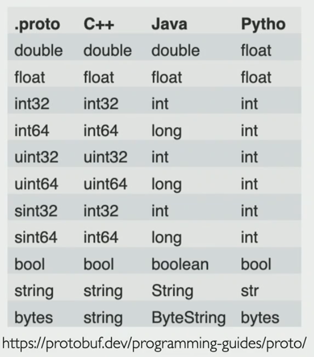

# resources & deployment

## intro
- Big 3 categories of software:
    1. Analysis code -- running Python code once on some data to get results
    2. Application -- continuously running the code, like a website
    3. Systems -- how to manage resources such as storage space
- Systems resources:
    - compute -> CPU, GPU
        - CPUs can each have multiple cores, which can be independently executing "core code" (machine code)
        - More cores means that more tasks can be run simultaneously
        - High level code -> compiled to bytecode -> ran by a VM -> VM is running on a core
        - GPU has many cores that are coordinated and slow because they have to run together
        - Cost measurement: FLOPS (floating-point operations per second)
    - mem -> RAM
        - RAM stores bits
        - Small, volatile (lost upon reboot) and fast
    - storage -> HDD, SSD
        - Data read/written in blocks of many bytes/blocks
        - Large, nonvolatile, slow
        - How fast can be read/write data? This is measured in throughput
    - network -> NIC (network interface card)
        - Data access speed can be based on network topology -- which servers are physically closest
- How do we efficiently utilize the four above resources?
    1. Scale UP: get more mem/compute power
    2. Scale OUT: cluster machines (expensive)

---

## deployment 
### (linux)
- `which` where something is installed / located
- shebang line tells you what interpreter should run the code
- `|` pipe character chains output from one program to the input of another program
    - programs don't wait for the previous one to conclude, they use streams
- `>` redirects input/output
    `&> out.txt` sends stdout and stderr to `out.txt`
    `2>` just sends stderr somewhere
- `&` sends program to the background to run asynchronously
- `wc` word count produces `lines words chars`
- `grep` search 
- `find` finds all files wrt current dir
- `>>` append to a file instead of overwriting it with `>`
- `ps` lists running processes
- `kill [id]` kills a process by id
- `pkill [name]` kills a process by name
- `htop` memory usage
- `df -h` storage usage
- `lsof` list open files, shows every file that every program has open
    - `-i tcp` shows which programs are running using tcp


### (docker)
- **Virtualization** is the idea that processes are given private resources such as memory or hardware
    - One example is virtual address spaces which are chunks of memory in a larger block of memory, another example is a VM
- Docker is a way of creating lightweight virtual operating systems, which are called *containers*
- The purpose of containers / VMs are to create sandboxes which can run code in an isolated environment
    - For example, running malicious code in a sandbox will not affect anything outside of the sandbox
- **Docker image**: a snapshot of a container
    - Containers can be created on your VM from an image
    - Dockerfiles set up environments
        - Dockerfiles will cache intermediate progress, so it's good practice to put stuff that's stable at the top, and stuff that's constantly changing near the bottom of the Dockerfile
- Use `docker run -it IMAGE_NAME bash` to get an interactive terminal to run inside a docker container
- Use `docker run IMAGE_NAME sh -c "COMMAND"` to run a command inside an image without going into the image
- Useful troubleshooting commands: `logs`, `exec`, `stats`, `kill`
- Each container has its own set of ports
    - If we have two containers, `lo` and `ens0`, then there is a port 80 for each of them
    - We can manually map ports from the laptop to a virtual machine, which would allow the user to specify which port 80 they want to use
- Docker orchestration is for deploying many containers (cluster) that are cooperating, ie: Kubernetes or ßDocker compose
    - Create a file named `docker-compose.yml` to get started
```yaml {title="example docker compose file", linenos=false}
services:
    jupyter:
        image: myimg
        deploy:
            replicas: 3
    # TODO: other processes
```

---

## memory resources 
### (caching)
- There is latency when loading data from RAM into CPU, the solution to this is the cache "hot" data
- Caching is a resource tradeoff -- if I cache a file, I avoid rereading from storage, but I'm using up memory
- What do we cache? Data/webpages that we need to access repeatedly
- When do we cache? The first time we read something, it is added to the cache
- When do we remove (evict) from the cache? Depends, there are several policies
    - Why do we evict? Limited cache space
    - Random: remove cache entry at random
    - FIFO (first in, first out): remove whatever has been in the cache the longest
    - LRU (least recently used): remove the cache item that was accessed the longest ago
- FIFO and LRU are bad when you need to keep scanning the same data repeatedly because you can have a situation where you evict the values that you need next
    - Cache size = 4, Data = [1,2,3,4,5,1,2,3,4,5], then the hit rate is 0%
- Avg latency = (hit% * hit latency) + (miss% + miss latency)

---

## compute resources 
### (pytorch numbers)
- Specify exactly how many bits are used for the numbers we're working with (uint8, float32, etc)
    - Tradeoffs: precision, range, memory
- Numbers in PyTorch are called "tensors"
- Ints will overflow/underflow, floats will return as inf or nan
- Sigmoid function maps to 0 or 1
- A PyTorch model (`torch.nn.Linear`) is like a function, it can be called on tensor data
- Callable objects in Python
    - Use the `__call__` function to define what happens if that object is used as a function
```python
class Mult:
    def __init__(self, factor):
        self.factor = factor

    def __call__(self, number):
        return number * self.factor

double = Mult(2)
double(10) # prints 20

triple = Mult(3)
triple(5) # prints 15
```


### (pytorch optimization)
- Gradient is the slope at a particular location (in a function)
- Stochastic gradient descent: optimization using slopes
```python
x = torch.tensor(0.0, requires_grad=True) # init at x = 0.0
optimizer = torch.optim.SGD([x], lr=0.01) # optimize x values with learning rate 0.01

for epoch in range(5):
    y = f(x) # apply f to get new y value
    y.backward() # figuring out gradient wrt y -> y/x

    optimizer.step() # makes a change to variables based on gradient and learning rate
    optimizer.zero_grad() # resets gradient to 0 because `.step()` adds to the current gradient value
```
- Learning rate is hard to optimize -- too big and you will miss the target, too small and it will take too long to solve


### (pytorch ml)
- Random split
    - Randomly split into train, validation, and test data sets
    - Why might a model score worse on test data than on validation data? Because we chose the model that fits the best to the validation set.
- Deep learning uses models that are deeply nested functions
$$y = \text{model}(x) = L_N(R(L_{N-1}(R(\cdots(L_1(x))))))$$
- Each $L_k(x)$ stands for a model represented by $L_k(x) = xW+b$ while $R$ stands for a function like sigmoid or ReLU
- PyTorch helps us track computations through DAGs

- Loss (Mean Squared Error) depends on a lot of things, so loss is what we try to optimize
- Stochastic gradient descent is doing gradient descent in shuffled batches so that we can minimize issues with not enough RAM
- The `df.pivot` function can reformat tables!
- To use PyTorch for ML, we want to have a DataSet (ds) and a DataLoader (dl)
    - The DataSet is a clean, raw representation of the data that we are using
    - The DataLoader basically helps enumerate and access the DataSet
        - Can help with creating batches and shuffling
```python {title="basic training loop", linenos=false}
model = torch.nn.Linear(1, 1)
optimizer = torch.optim.SGD([model.weight, model.bias], lr=0.00001)
loss_fn = torch.nn.MSELoss()

for epoch in range(50):
    for batchx, batchy in dl:
        predictedy = model(batchx)
        loss = loss_fn(batchy, predictedy)
        loss.backward()   # update weight.grad and bias.grad
        optimizer.step()  # update weight and bias based on gradients
        optimizer.zero_grad()  # weight.grad = 0 and bias.grad = 0

    # how well are we doing?
    x, y = ds[:]
    print(epoch, loss_fn(y, model(x)))
```


### (threads)
- Simple Python programs use at most ONE core so speed is capped by how much work one core can do
- A **process** is a running program which has its own **virtual address space (VAS)**
    - The process cannot directly access physical memory
    - A VAS can have holes

- A CPU core can be pointed at one instruction in the code at any time
    - Each core has its own cache
- Threads have their own instruction pointers and stacks, but share the heap
    - Single-threaded processes have one pointer, multi-threaded processes have multiple pointers
- Context switch: switching between threads -- doing it too much is slow

- Race conditions: when two threads both access a shared variable and problems occur


### (locks)
- Two threads can be interleaved and executed in a way that causes information to be lost
    - Modifying global variables and loading/storing simultaneously
- We want atomicity -- if it happens, then it happens together (otherwise not at all)
- A **lock** (`threading.Lock()`) is held by only one thread at a time and protects critical sections from being inturrupted
    - Putting locks in the wrong places can still cause errors so the importantthing is to be careful / generous with where you're putting locks
    - Locking and releasing is also an expensive operation!
- If an exception occurs before the lock is released, then the code will never execute because the lock is still active
    - Use `with` statements

---

## network resources
### (RPC)
- Every Network Interface Controller (NIC) has their own unique Media Access Control (MAC) address
    - Some devices randomly change or mask their MAC addresses for privacy (there are some good papers on this)
    - Computers can only send messages to other computers which are on the same network
- An **internet** is just a group of networks; the Internet is the global one...?
- A **packet** is a group of bytes that has an IP address which is its destination location
- Private networks allow for duplicate IPv4 addresses

- Network Address Translation (NAT) boxes can help you forward public IP addresses into private IP addresses in a network
- Different port numbers on the same IP address can be running different servers
- There are two main transport protocols:
    - TCP: reliable - will guarantee that the message is sent in the original order and will try to resend lost packets
    - UDP: unreliable - doesn't do extra work, just sends the packet
- HTTP methods: POST (create new), PUT (update), GET (fetch), DELETE for dealing with HTTP messages
- RPC stands for Remote Procedure Call -- calling a function remotely
    - gRPC, which helps with calling functions on a server, is built on top of HTTP
- With RPCs, the code can be in different languages, so there needs to be a universal representation for types
    - Serialize (encode) and deserialize (decode) the types using a table -- this is called protobufs
    - What do we have to take into consideration? Types, byte order, encoding length

- Make a `.proto` file to define messages that are being sent between two computers, then run gRPC on it to create classes
    - The classes are automatically generated in the specified language
    - The messages are basically objects that you can create
```proto {title="Example proto file for multiplying two numbers together", linenos=false}
syntax = "proto3";

service Calc {
    rpc Mult(MultReq) returns (MultResp)
}

message MultReq {
    int32 x = 1;
    int32 y = 2;
}

message MultResp {
    int32 result = 1;
}
```
- To call a function, you have to define an RPC in the format `rpc NAME(ARGUMENTS), returns (RETURN VALUE);` as a part of a service inside the `.proto` file

---

## storage resources
### (file systems)
- **Block devices** are long term storage devices that are accessed in units of blocks
- Caching is for storing data that might be accessed later, buffers mostly pertain to minimizing function calls for the same data, storing one large block/page of data when lines are being read one at a time
- Small reads (<4KB):
    - No good way to read only one column without also reading everything else
    - The whole block has to be accessed to get a small portion of data
- **Hard disk drives (HDDs):**
    - Steps to transfer data:
        1. Move pointer to correct track
        2. Wait for disk to rotate until data is under head
        3. Transfer data
    - For transferring small amounts of data, then the first two steps will dominate the processing time
    - Solution: assign sequential block numbers for HDDs
- **Solid state drives (SSDs):**
    - No moving parts and can read data in parallel
    - Blocks and pages are used in different context than HDDs
    - Erase content in blocks, write content in pages, but can't rewrite to individual pages
    - To rewrite content, SSDs just put it somewhere else and it needs to be tracked

- Block devices can be divided into partitions
- Redundant Array of Inexpensive Disks (RAID) controllers can make multiple devices look like one device
- Local file systems can track files by segmenting them into blocks and tracking which blocks are relevant to the file -- this is called an inode structure
    - Directories contain inode mappings and names of files
- Each drive has its own file system "tree"


### (formats and DBs)
- Files store sequenes of bytes, but how do we organize the bytes in a useful format?
    - CSVs are row oriented
    - Parquets are column oriented
- Choosing a file format depends on how we want to access the data
    - Transactions processing: reading or writing rows as needed
    - Analytics processing: computation over many rows to get specific columns
- Parquets are much faster and the preferred data type for analytics processing!
- Protobufs are the best way to get the smallest amount of bytes used for a piece of data
- Compression is the idea of avoiding repetition in datasets
    - Parquets use snappy compression which prioritizes high speed over maximum compression
- Schema is the structure of the dataset, like the types and field names
- Databases have a bunch of tables which a user can query to get specific data back
    - SQL is the most popular querying language
    - Large DBs are usually only fast at either transactions or analytics, but not both
    - DB types: online transactions processing (OLTP) typically row oriented, online analytics processing (OLAP) typically column oriented
    - Extract-transform-load (ETL) is the process of transferring data from OLTPs into OLAPs


---

# clusters and hadoop ecosystem


# further reading
- Linear Algebra and Learning From Data by Gilbert Strang
- Machine Learning with PyTorch and Scikit-Learn